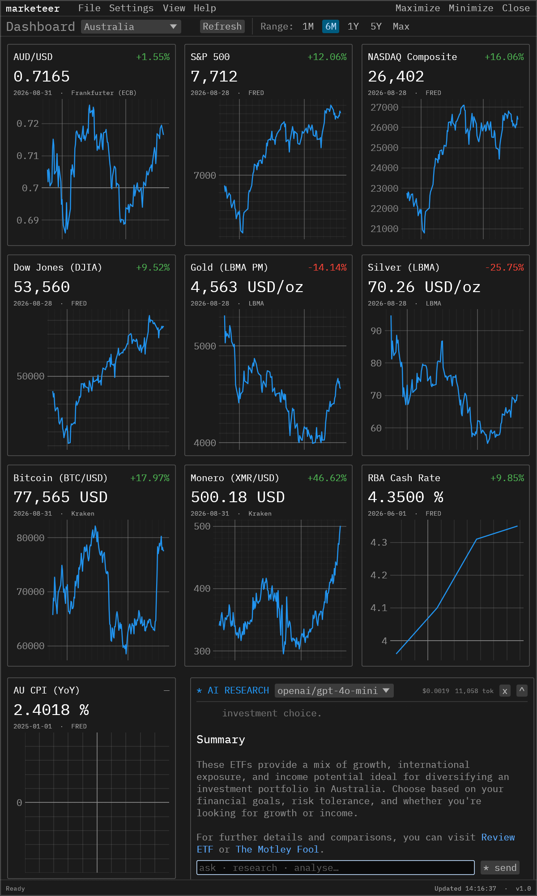
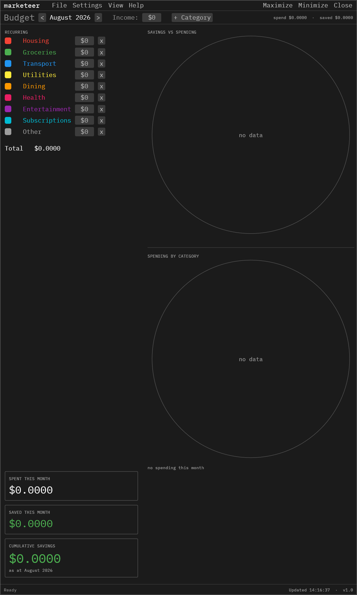
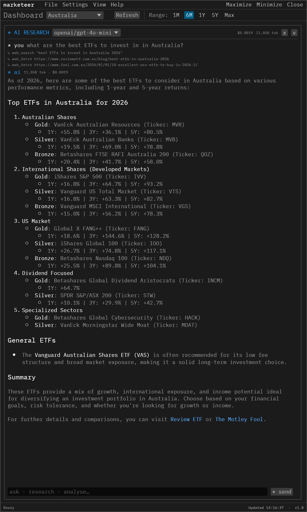

# Marketeer

A personal macro + micro economics command centre. Single-binary desktop app in Rust (egui) that puts markets, budgets, and an AI research analyst in one frameless window — fully local, no accounts, no telemetry.

**Pre-release: Currently only supports Australia**

---

  
  
  

---

## What it does

### Macro dashboard
- Live market cards: AUD/USD, S&P 500, Nasdaq, Dow Jones, gold, silver, BTC, XMR
- RBA cash rate and AU CPI (year-over-year, computed in-app)
- Range selector (1M / 6M / 1Y / 5Y / Max) with per-range change badges
- Country selector (10 countries; Australia active)
- Auto + manual refresh through a background worker thread

### Budget screen
- Monthly spreadsheet of colour-coded spending categories, split into **Recurring** and **One-off** sections (custom categories, custom colours, negative amounts allowed)
- Manual monthly income and a manually entered, per-month **cumulative savings** value (click to edit — never auto-computed)
- Bottom cards: SPENT THIS MONTH, SAVED THIS MONTH, CUMULATIVE SAVINGS
- Two pie charts: savings vs spending, and spending by category, with grid legends
- `View > Budget >` options: count one-off spending in the category pie; auto colour-sort (rainbow palette)
- Month navigation; data stored per month

### AI research chat
- Any OpenAI-compatible chat API (OpenRouter by default), streaming
- Your live market data is injected as context, so answers reference your actual dashboard
- Tools: `web_search` (DuckDuckGo) and `web_fetch` — the model can research before answering
- Reasoning traces, markdown rendering, stop button mid-generation
- Token usage and cost: per-request figures beside the latest reply, cumulative totals in the header — persisted across restarts, reset only when the chat is cleared
- Conversation history persisted locally

## Data sources (free / official)

| Source | Series |
|---|---|
| FRED | SP500, NASDAQCOM, DJIA, RBA cash rate (IRSTCI01AUM156N), AU CPI (AUSCPIALLQINMEI) |
| Frankfurter (ECB) | AUD/USD daily |
| Kraken | BTC, XMR OHLC + live tickers |
| LBMA | Gold, silver |

FRED needs a free API key (enter in Settings). Everything else is keyless.

## Storage

Everything lives in `~/.economy.db` (SQLite): price history, chat, settings, and all budget data. Delete the file to start fresh.

## Project layout

Deliberately minimal: the entire application is one file, `src/main.rs`.

- eframe/egui 0.36 UI with embedded IBM Plex Mono
- egui_plot for charts, custom-painted pie charts
- ureq for HTTP, no async runtime
- rusqlite (bundled) for persistence
- Background worker thread + channel; UI never blocks on network
